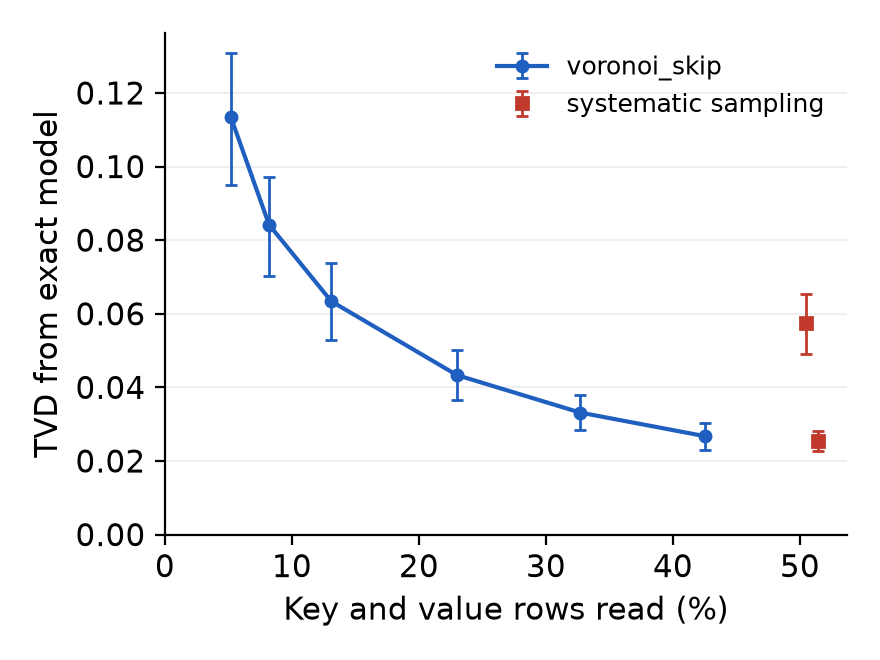

# Efficient inference by reducing KV cache reads

When a large language model (LLM) generates text, each new token reads the stored key and value vectors of every earlier token (the KV cache) from GPU memory. At long context that memory traffic, not arithmetic, limits decoding speed.

After reading about the SANTA algorithm ([arXiv:2605.01910](https://arxiv.org/abs/2605.01910)), I noticed that it avoids most value reads by sampling, and its Bernoulli qKᵀ sampling reduces how many features of each key are read, but it still reads part of every key to compute the sampling probabilities. I asked whether most keys could be skipped entirely. I developed a method, `voronoi_skip`, that decides which parts of the cache to read from small summaries of the keys, and wrote GPU kernels that run it inside a Qwen3 inference engine I wrote separately ([github.com/aaholmes/llms](https://github.com/aaholmes/llms)).

- **Speed:** at a 20% budget, decoding at 32,768 tokens is 1.30× faster on Qwen3-4B, at a TVD close to 64-sample sampling's (0.064 compared with 0.057), and 1.81× faster on Qwen3-0.6B. A 5% budget reaches 1.39× and 2.23× (2.40× at 40,448 tokens) at a clear fidelity cost: TVD 0.111 on Qwen3-4B and 0.133 on Qwen3-0.6B at 32,768 tokens, between Qwen3-4B with 8-bit (0.018) and naive 4-bit (0.144) weights, measured at 8,192 tokens.
- **Fidelity:** at the accuracy of 64-sample SANTA-style sampling, it reads 0.23–0.50× as much of the cache.
- **A negative result:** sampling the parts it skips, instead of dropping them, is worse at equal reads in every setting tested.

## Method

Attention weights each cached value by the softmax of the query's dot product with its key, so the few keys pointing along the query carry most of the weight. The method finds them without reading every key:

1. **Always read the first token and the 64 most recent tokens.** The first token acts as an attention sink, taking 36–65% of all attention at layers 12–35 of Qwen3-4B.
2. **Subtract the mean key** of each layer and KV head. This leaves attention unchanged, because softmax ignores a shift common to every score, and it is necessary: before centering, the keys at layer 0 all point almost the same way (average cosine similarity 0.99 with the mean).
3. **Group keys by direction** using 256 fixed random directions: each key joins the region of its nearest direction, so the regions are the Voronoi cells of those directions on the unit sphere (hence the name `voronoi_skip`). Each region keeps a running sum of its keys' directions, the minimum and maximum key length, and a count.
4. **Score each region without reading its keys**, as its maximum key length times the query's projection on its mean direction (minimum length when the projection is negative): an estimate of the largest attention score inside it.
5. **Choose once per KV head.** In Qwen3-4B four query heads share each KV head, so they rank regions jointly and read one set of rows.
6. **Read the top regions' keys and values up to a budget** and compute exact attention over them. The rest is dropped, so the result is slightly biased.
7. **Update the regions incrementally.** Each key is assigned once, when it leaves the recent window, and a head is recentered only when its mean has drifted noticeably, which after a long prompt is rare.

Fidelity is measured as total variation distance (TVD) between the model's next-token distribution and the exact model's, over 8 text chunks per setting. Perplexity is not used, because a biased method can push it *below* the exact model's.

## Results

*Fidelity compared with systematic sampling (SANTA's best variant).* Qwen3-4B, 8192-token context, WikiText-103; reads are key and value rows, including region summaries; [95% bootstrap CI over chunks].

| method | K+V rows read | TVD from exact |
|---|---|---|
| systematic sampling, 64 samples | 50.5% | 0.058 [0.049, 0.065] |
| `voronoi_skip`, 10% budget | 13.1% | 0.063 [0.053, 0.074] |
| systematic sampling, 256 samples | 51.4% | 0.026 [0.023, 0.028] |
| `voronoi_skip`, 40% budget | 42.5% | 0.027 [0.023, 0.030] |

*The same setting across budgets of 2–40%; the two systematic-sampling points are 64 and 256 samples.*

At 32,768 tokens the advantage shrinks: matching 64-sample sampling takes 0.50× its reads, and 256-sample sampling is not matched within a 40% budget. On Qwen3-0.6B it matches 64-sample sampling with 0.23–0.26× the reads, and on Python code every TVD is 2–3× lower than on WikiText. Choosing random regions instead gives 3–4× the TVD (at 2048 tokens), so the ranking does the work.

*End-to-end decoding.* The whole decode step runs as a CUDA graph (one recorded sequence of GPU operations replayed per token, removing Python overhead); the exact baseline is captured the same way. BF16, one RTX 5060 Ti (16 GB), batch 1; median ms per token:

| model | context | exact attention | 20% budget | 5% budget |
|---|---|---|---|---|
| Qwen3-0.6B | 32768 | 14.1 ms | 7.8 ms (1.81×) | 6.3 ms (2.23×) |
| Qwen3-0.6B | 40448 | 16.0 ms | 8.3 ms (1.93×) | 6.7 ms (2.40×) |
| Qwen3-4B | 16384 | 29.1 ms | 25.5 ms (1.14×) | 24.6 ms (1.18×) |
| Qwen3-4B | 32768 | 34.8 ms | 26.9 ms (1.30×) | 25.0 ms (1.39×) |

Fidelity at these settings: on Qwen3-4B at 32,768 tokens a 20% budget gives TVD 0.064 [0.052, 0.074] (64-sample sampling: 0.057); on Qwen3-0.6B a 10% budget already matches 64-sample sampling (0.091 compared with 0.095), and a 20% budget reads more. A 5% budget gives TVD 0.111 [0.093, 0.127] on Qwen3-4B (86.9% top-1 agreement with the exact model) and 0.133 [0.116, 0.147] on Qwen3-0.6B (84.8%), both at 32,768 tokens; fidelity at 40,448 tokens was not measured. The gain follows attention's share of the time per token: Qwen3-4B's 8 GB of weights cost ~22 ms to read, so the cache only matters at long context or when many sequences are batched.

*Sampling the skipped regions loses.* Reading the top regions exactly and sampling some of the rest, weighted by inverse inclusion probability, removes the bias. But at equal reads its TVD is 24–54% higher than reading more top regions, on both models and at 8192 and 32,768 tokens. Its error is almost all variance: after the top regions, the remaining attention is spread thinly over ~200 regions, and a few sampled regions estimate that tail less accurately than dropping it does.

More detail, including kernel timings, context-length and region-count scans, and a comparison with weight quantization, is in [docs/results.md](docs/results.md).

## Related work

After building this, I found that it is close in spirit to ClusterKV ([arXiv:2412.03213](https://arxiv.org/abs/2412.03213)), which also groups keys by direction (with k-means clustering) and reads the top groups exactly. The differences are that here keys are mean-centered first, the groups come from fixed random directions updated incrementally instead of periodic clustering, groups are scored by mean direction times maximum or minimum length, one selection is shared by the query heads of each KV head, and a recent window is always read. Quest ([arXiv:2406.10774](https://arxiv.org/abs/2406.10774)) selects fixed 16-token pages using per-page minimum and maximum keys. MagicPIG ([arXiv:2410.16179](https://arxiv.org/abs/2410.16179)) also centers keys, then samples them with locality-sensitive hashing (hashes that put similar vectors in the same bucket). SANTA++ ([arXiv:2609.35629](https://arxiv.org/abs/2609.35629)), from SANTA's authors, samples groups of keys.

## Limits and next steps

Fidelity is measured as TVD on WikiText and Python code, up to 32,768 tokens, on two models of one family; task benchmarks (such as RULER or LongBench) were not run, and there is no direct comparison with ClusterKV or Quest yet. Speed is measured at batch 1 on one consumer GPU. Next: compare with ClusterKV- and Quest-style selection at equal reads, test SANTA++-style sampling, measure task accuracy, and support batching.

## Earlier work: sampling the cache

Before the method above, I reproduced SANTA's sampling estimator in PyTorch and tested extensions of it: exact computation of the heaviest tokens, contiguous-block sampling, cluster-based key skipping, and a learned correction for sampling bias. Plain systematic sampling matches exact perplexity within +0.19% while reading 3.5% of cached values; none of the extensions beat it. Details are in [docs/sampling.md](docs/sampling.md).

## Repository

- `src/ssa/attn/` — attention methods behind one interface, `attn(q, K, V, impl=...)`; `src/ssa/sampling/` — index sampling.
- `src/ssa/kernels/` — Triton GPU kernels (region maintenance and selection, compaction, attention over selected rows).
- `src/ssa/models/` — the adapter into the inference engine, and the CUDA-graph decode step.
- `src/ssa/harness/` — experiments: `accept_sweep` measures TVD end to end, `decode_speed` times decoding, `kernel_bench` times the kernels; others cover the sampling work. Real-model harnesses need a CUDA GPU and download the model.
- `src/ssa/results/` — result files, each recording the git commit, GPU and library versions that produced it.

Setup: `uv sync`, then `uv run python -m pytest` (242 tests; the kernel tests need a CUDA GPU and are skipped otherwise). The engine is installed from [github.com/aaholmes/llms](https://github.com/aaholmes/llms) at a pinned commit.

## License

Apache License 2.0; see [LICENSE](LICENSE).
